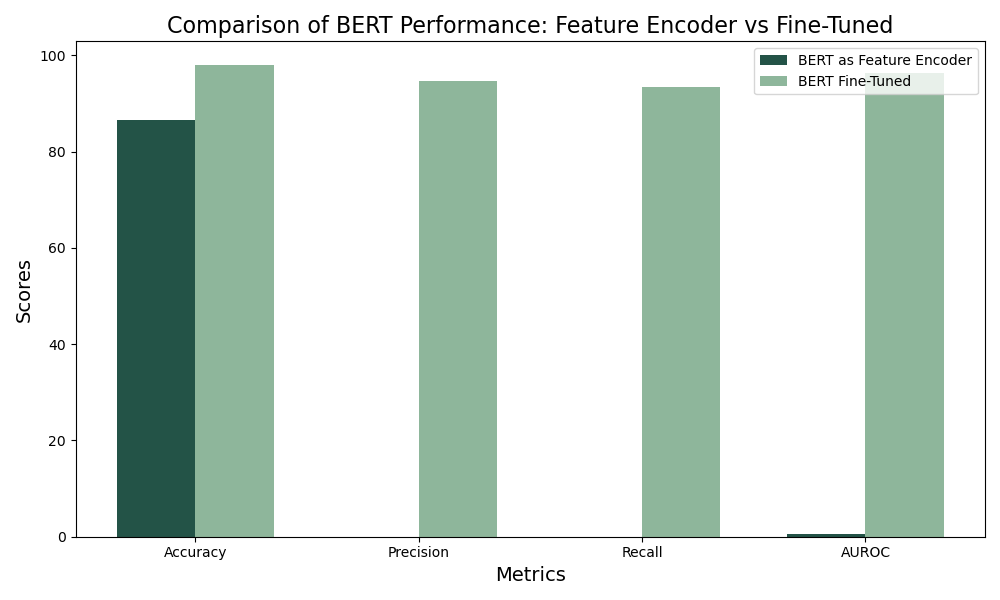

# SPAM Bert Classifier 
## We fine tune a small BERT model for classification. First, download 'bert-base-uncased' from Hugging Face using the Transformers library. We compare how fine tuning everything does vs fine tuning just the MLP head. 

## Methods
The code compares two different methods of utilizing a pre-trained BERT model for text classification: BERT as a feature extractor (MLP head) and BERT Fine-Tuned.

### BERT as a Feature Extractor (MLP head): 
In this method, the pre-trained BERT model is used to extract features from text data, which are then fed into a separate machine learning model (usually a Multi-Layer Perceptron or MLP) for classification. The BERT model itself is not fine-tuned during training; only the parameters of the additional classifier model are adjusted. This approach leverages the rich representations learned by BERT during pre-training but does not adjust BERT's weights to better suit the specific task at hand. 

### BERT Fine-Tuned: 
This method involves further training (fine-tuning) the pre-trained BERT model on a specific task, in addition to training the classifier layer. During fine-tuning, the weights of the entire BERT model are updated in a way that makes them more relevant to the specific text classification task. This approach is more computationally expensive than using BERT as a feature extractor because it involves adjusting a much larger number of parameters. However, fine-tuning can lead to better performance since the model is more closely adapted to the characteristics of the target task. The metrics provided (e.g., bert_fine_tuned = [98, 94.59, 93.43, 96.25]) indicate significant improvement across all evaluated aspects: Accuracy, Precision, Recall, and AUROC.

The primary difference between these methods is whether the BERT model's weights are frozen or adjusted during the training process. Using BERT as a feature extractor does not change the pre-trained weights, relying on BERT's general understanding of language. In contrast, fine-tuning adapts BERT specifically to the task and dataset at hand, potentially achieving higher performance at the cost of increased computational resources and training time. The code outlines the process of loading data, preparing it for training, setting up a BERT model for sequence classification, and implementing these two approaches to compare their effectiveness on a text classification task.

### Results:

When we fine-tune the entire BERT model, it does really well across all measures. It gets a validation accuracy of about 98%, with precision at 94.59%, recall around 93.43%, and an AUROC of 0.9625. However, when we use BERT just as a feature encoder, the results aren't as good. The validation accuracy is 86.56%, but precision, recall, and AUROC are very low, with both precision and recall at 0.0 and AUROC at only 0.5.

Looking at what this means, the fine-tuned model's high scores in accuracy, precision, recall, and AUROC show that it's not just good at predicting the most common class but also at spotting the less common one, assuming we're dealing with a two-class problem. This tells us it's a well-balanced model that can tell the difference between classes. On the other hand, the feature encoder model's really low precision and recall, both 0.0, suggest it's probably too focused on one class, often just picking the most common one. The AUROC of 0.5, which is like guessing, adds to this problem. Even though it seems accurate, this model isn't really learning from the data.

The difference between these two methods is really noticeable. Fine-tuning the entire BERT model leads to a strong and effective classifier. In contrast, using BERT only as a feature encoder ends up with a model that doesn't classify well, likely just going for the most common class without seeing the finer details in the data. This shows that for the specific dataset and task we're working with, just using BERT's pre-trained features isn't enough.

 the main difference lies in how the model’s deep layers are allowed to update and adapt to our specific task. Full fine-tuning allows for a comprehensive learning process, deeply integrating task-specific nuances into the model, while using BERT as a feature encoder relies solely on the generic, pre-trained understanding of language, which may not be sufficient for more specialized or nuanced tasks.

The Fine-Tuning Process:
Fine-tuning a model like BERT involves a nuanced adjustment of its pre-trained weights through continued training on a task-specific dataset. Our code illustrates this by engaging BERT in a text classification task, where it learns from labeled examples to distinguish between categories. Here’s how we accomplish this:

Initialization: We begin with a pre-trained BERT model, leveraging its foundational understanding of language. This model, originally trained on a vast corpus, brings a rich contextual grasp of language nuances.

Data Preparation: The next step involves preparing our text data, which includes tokenization, generating attention masks, and encoding our inputs to formats compatible with BERT. This preparation is crucial for translating our raw text into a form BERT can process effectively.

Model Customization: The BERT model is then customized for sequence classification by adding a classification layer on top. This layer is pivotal, as it will be fine-tuned alongside the pre-trained layers to adapt to our classification task.

Training: With the model set up, we proceed to the training phase. Here, fine-tuning occurs as the model weights are adjusted based on our specific dataset. The training involves feeding the model with our input data, comparing its output to the actual labels, and adjusting the weights through backpropagation to minimize the discrepancy between predicted and true labels.

Throughout training, we employ an optimizer (AdamW) with a learning rate as suggested in the original BERT paper, ensuring that we adjust the model weights in a controlled manner that's conducive to learning our task-specific nuances.
Evaluation: After training, we evaluate the model using our validation set to assess its performance across several metrics, including accuracy, precision, recall, and AUROC. This evaluation not only measures how well the model has been fine-tuned but also provides insights into its readiness for deployment.

